<p align="center">
  
</p>

<p align="center">
  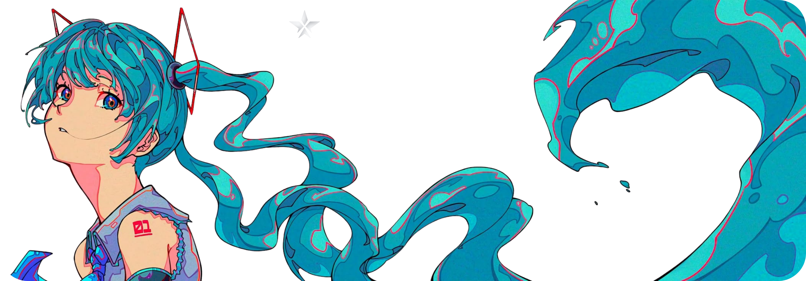
</p>

<p align="center">
  <em>“If you can see it… it’s already too latee.”</em>
</p>

# ⚡ WUZEN
> **Advanced Android Device Control Framework for Security Teams**  
> Built for **red team operators** and **security researchers** to simulate modern mobile threats in controlled environments.  

⚠️ **Disclaimer**: This project is for **educational and authorized security testing only**.  
Use of this tool outside legal engagements may violate laws and GitHub policies.  

---

## ✨ Overview
**WUZEN** provides:  
- Full-spectrum Android assessment modules  
- Realistic adversary simulation tools  
- Persistence & stealth testing for mobile environments  

---

# 🧩 Feature Categories  

---

## 🔹 Baseline Recon
Core device information gathering for **posture assessment**.  
- 📩 SMS log & delivery simulation  
- 📞 Call & contact extraction  
- 📡 SIM / system / apps inventory  
- 📍 Location telemetry in background  
- 📸 Camera access checks (front/back)  
- 🔔 Notification event logging (chat, mail, social)  
- 👻 Selective notification suppression  

---

## 🔑 Stealth Operations
Simulating adversary persistence & covert access.  
- ⌨ **Input Capture** – keystroke & screen event monitoring  
- 🖥 **Covert Session Viewer (HVNC)** – hidden remote screen stream  
- 🔑 **MFA Testing Modules** – Google / Microsoft authenticator simulation  
- 📲 **Push Simulation** – crafted notification delivery  
- 🚀 **Background Actions** – open apps/links in stealth  

---

## 🕷 Advanced Modules
Adversary simulation components for high-fidelity testing.  
- 🪪 Fake identity prompts (credential phishing emulation)  
- 🧩 Injection & overlay simulations  
- 💀 Custom payload testing toolkit  
- ❄ Device lock/freezer simulation  
- 📝 Local data extraction checks  
- 📚 200+ prebuilt templates for red team campaigns  

### 💰 Financial Security Testing
- **Exchange / Wallet simulation modules**  
- **Clipboard replacement scenarios** (BTC, ETH, XMR, DOGE, SOL, ADA, TRX, etc.)  

### 🛡 Resilience Testing
- Uninstall protection scenarios  
- Boot persistence checks  
- Background process survivability  

---

# 🖥 Control Panel
Central management interface for campaign orchestration.  
- 🛠 Toggle modules: Input, SMS, Notifications, Screen logging  
- 👻 Hide/Show notification events  
- 💼 Multi-wallet test configurations  
- 🔗 Manage devices via web panel + Telegram integration  
- ♾ Unlimited devices, isolated containers  
- ⚙ Per-device configs  
- 🪪 Trigger verification pop-ups remotely  


---

## 🌐 Web Panel (PC View)
<details open>
  <summary>📂 Click to expand Web Panel screenshots</summary>
  <br>

  <p align="center">
    <a href="assets/wupics/pcview/Dashboard.png">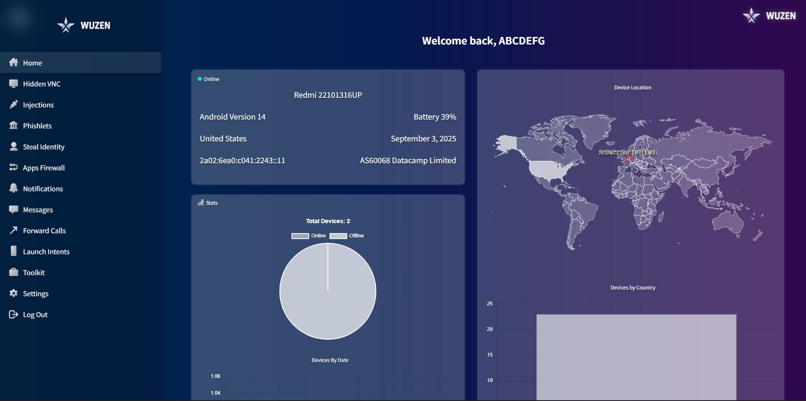</a>
    <a href="assets/wupics/pcview/Settings.png">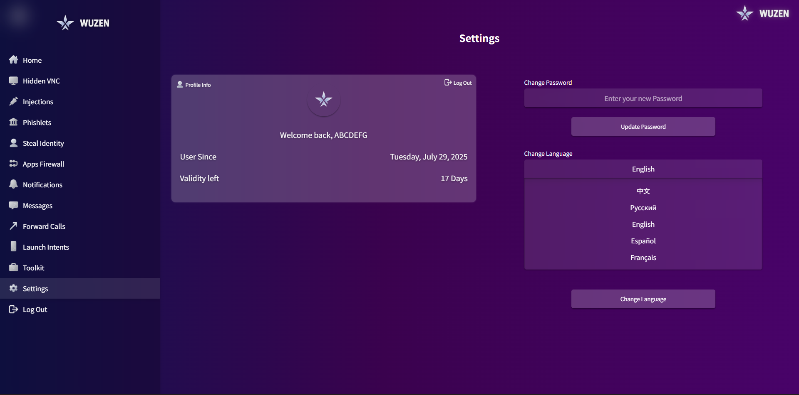</a>
  </p>

  <p align="center">
    <a href="assets/wupics/pcview/App firewall.png"></a>
    <a href="assets/wupics/pcview/Forward calls.png"></a>
  </p>

  <p align="center">
    <a href="assets/wupics/pcview/HVNC.png">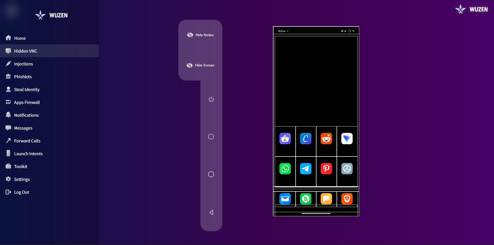</a>
    <a href="assets/wupics/pcview/VNC.png">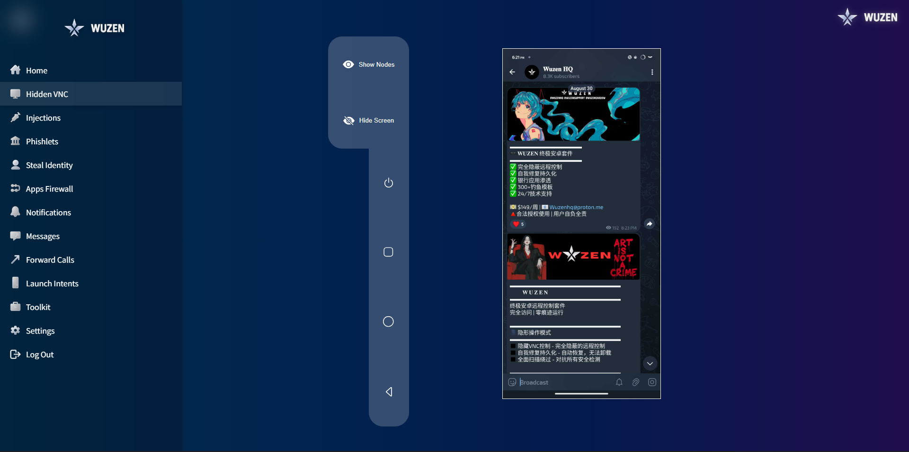</a>
  </p>

  <p align="center">
    <a href="assets/wupics/pcview/Injections.png">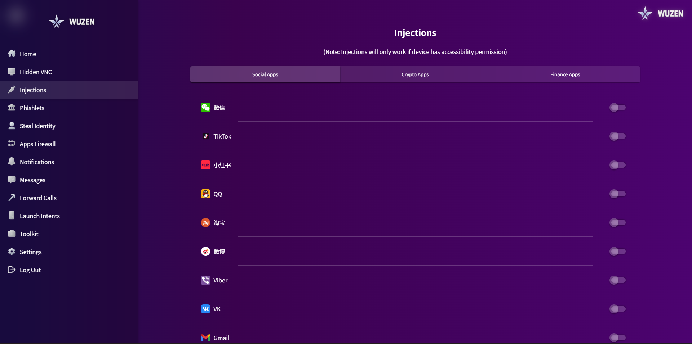</a>
    <a href="assets/wupics/pcview/Injections 2.png"></a>
    <a href="assets/wupics/pcview/Injections 3.png"></a>
  </p>

  <p align="center">
    <a href="assets/wupics/pcview/Launch Intents.png"></a>
    <a href="assets/wupics/pcview/Launch Intents 2.png"></a>
  </p>

  <p align="center">
    <a href="assets/wupics/pcview/Login page.png"></a>
    <a href="assets/wupics/pcview/Messages.png">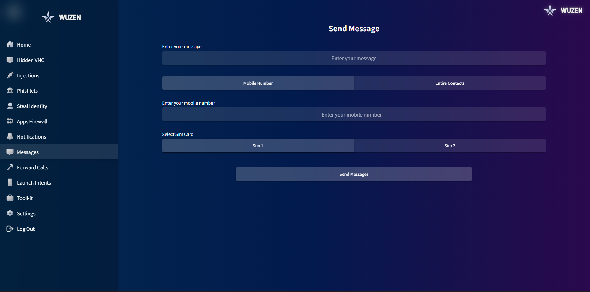</a>
  </p>

  <p align="center">
    <a href="assets/wupics/pcview/Notifications.png">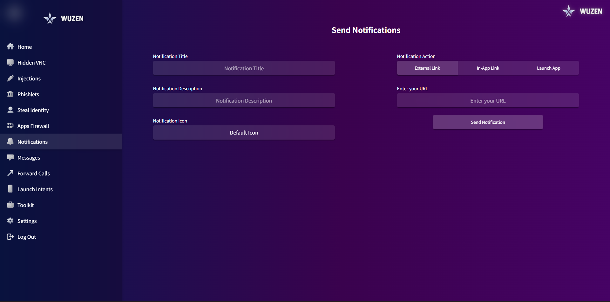</a>
    <a href="assets/wupics/pcview/Phislets.png">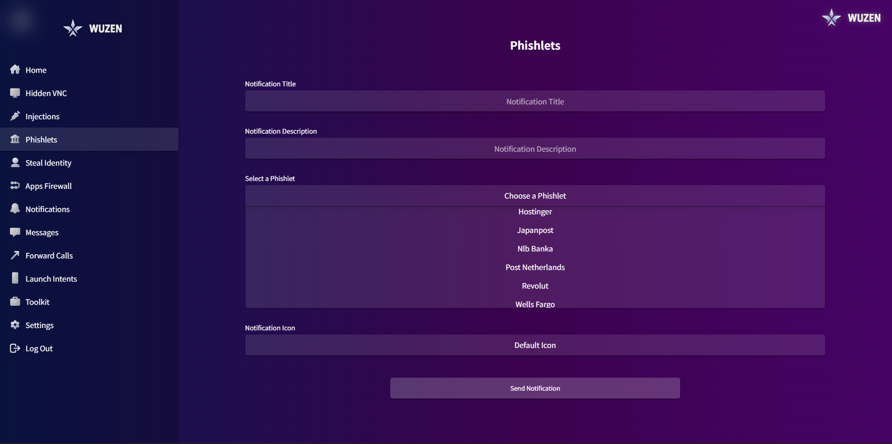</a>
  </p>

  <p align="center">
    <a href="assets/wupics/pcview/Steal Indentity.png"></a>
    <a href="assets/wupics/pcview/Toolkit.png">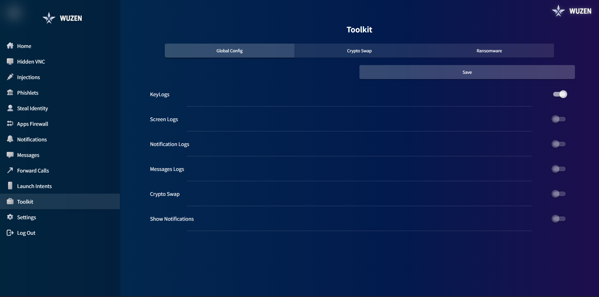</a>
  </p>

  <p align="center">
    <a href="assets/wupics/pcview/Toolkit 2.png"></a>
    <a href="assets/wupics/pcview/Toolkit 3.png"></a>
  </p>
</details>

---

## 📱 Telegram Panel (Tele View)
<details open>
  <summary>📂 Click to expand Telegram Panel screenshots</summary>
  <br>

  <p align="center">
    <a href="assets/wupics/Tele view/Wuzen panel 1.jpg"></a>
    <a href="assets/wupics/Tele view/Wuzen panel 2.jpg"></a>
    <a href="assets/wupics/Tele view/Wuzen Panel 3.jpg"></a>
  </p>

  <p align="center">
    <a href="assets/wupics/Tele view/Wuzen panel 4.jpg"></a>
    <a href="assets/wupics/Tele view/Wuzen panel 5.jpg"></a>
    <a href="assets/wupics/Tele view/Wuzen panel 6.jpg"></a>
  </p>
</details>

---

# 🖤 Why WUZEN?
WUZEN is not a “remote access tool.”  
It’s a **research & training framework** to:  
- Emulate advanced mobile threat actors  
- Test resilience against real-world attack vectors  
- Train incident responders in **stealth & persistence detection**  

---

<p align="center">
  
</p>

---

## 📡 Contact
<p align="center">
  <a href="https://t.me/WuzenHQ" target="_blank">
    
  </a>
  <a href="https://wechat.com/wxid_3c2z5u8xyprv22" target="_blank">
    
  </a>
</p>

---

<p align="center">
  
</p>

---

## 🏷 Keywords & Discovery

```markdown
#️⃣ #MobileSecurity #RedTeam #AndroidPentesting #CyberSecurity  #Android #Pentestin #CyberSecurity #EthicalHacking #MalwareAnalysis 
#️⃣ #ReverseShell #APK #AndroRAT #Botnet #Spyware #Exploit #Termux #Phishing #Hacktoberfest #InfoSec
#️⃣ #ThreatSimulation #SecurityResearch #AdversarySimulation 
#️⃣ #HVNC #StealthOps #SecurityTesting #CyberDefense #InfoSec
#️⃣ #android #python #java #interpreter #backdoor #reverseshell #exploit #sockets #apk 
#️⃣#androidapplication #rat #hacktoberfest #androrat #interpretercommands #hack #botnet 
#️⃣#advancedhacking #androidmalware #androidhacking #pentesting #devicemanagement 
#️⃣#hackingtool #antivm #remoteaccesstrojan #remoteaccesstool #androidremote #bypassvm 
#️⃣#javatarat #pentestingandroid #phprat #telegram #telegrambot #phishing #kotlinandroid 
#️⃣#termux #termuxhacking #androidpentesting #telegramrat #androidbotnet 
#️⃣#androidexploitation #androidspyware


🔑 Keywords: android control framework, mobile security testing, 
red team tools, stealth operations, HVNC Android, persistence testing, 
adversary simulation, authorized android python java interpreter backdoor reverse-shell
exploit sockets apk android-application rat hacktoberfest androrat interpreter-commands
hack botnet advanced-hacking android-malware android-hacking pentesting device-management
hacking-tool anti-vm remote-access-trojan remote-access-tool android-remote bypass-vm java-rat pentesting-android
php-rat telegram telegram-bot phishing kotlin-android termux termux-hacking android-pentesting telegram-rat
android-botnet android-exploitation android-spyware
```


<p align="center">
  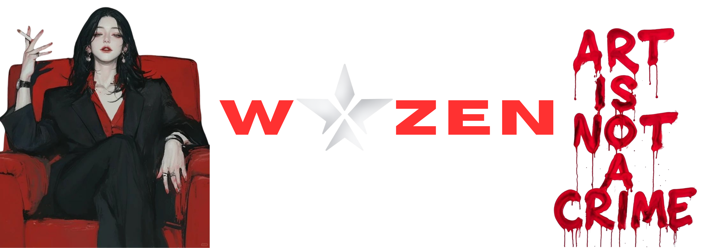
</p>


<p align="center">
  
  <br/>
  <sub><em>Zhōngjí kòngzhì - Juéduì yǐnshēn - Wánměi xíngdòng</em></sub>
  <br/>
  <sub><em>Ultimate Control - Absolute Stealth - Perfect Operation</em></sub>
</p>
